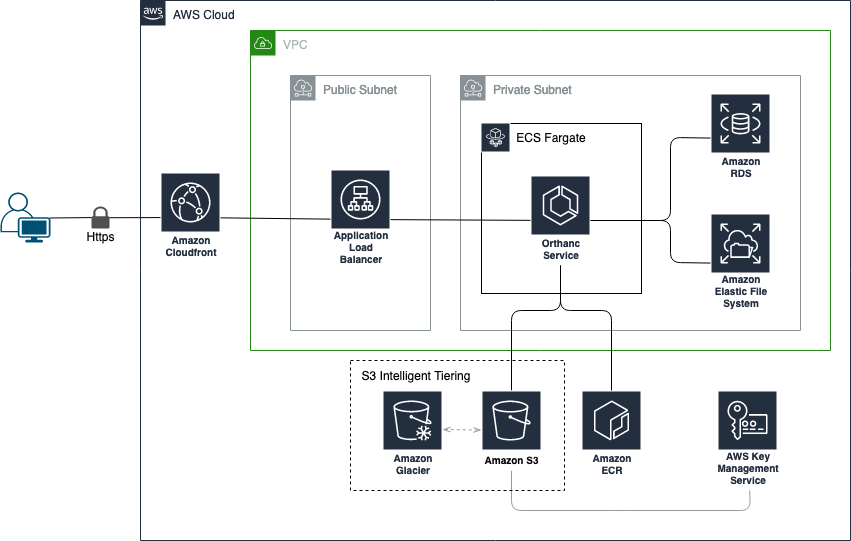

# Orthanc deployment with S3 compatibility using AWS CDK

This project aims to help you provision a ready-to-use [Orthanc](https://www.orthanc-server.com/) cluster on Amazon ECS Fargate, with support for the official S3 plugin. The infrastructure code is using the [AWS Cloud Development Kit(AWS CDK)](https://aws.amazon.com/cdk/).

Orthanc is an open-source DICOM server, which is designed to improve the DICOM flows in hospitals and to support research about the automated analysis of medical images. Orthanc lets its users focus on the content of the DICOM files, hiding the complexity of the DICOM format and of the DICOM protocol.

## Solution Overview


## Features

- [x] "One-click" serverless deployment
- [x] Infrastructure is split into 3 interdependent stacks (Networking, Storage, ECS Fargate Cluster)
- [x] Configurable DICOM image storage (EFS or S3)
- [x] DICOM indexes are stored in RDS Postgres11
- [x] Configurable S3 Object Lifecycle policies to support archival scenarios
- [x] Secure HTTPS connection using Cloudfront
- [x] Automatic build of the official S3 plugin using a multi-stage Docker image file

## Changelog
- 05.09.2024
  - Upgraded CDK to latest available version
  - Switched to the official Orthanc docker image (that includes the precompiled S3 plugin)
  - Upgraded PostgreSQL version to v15
- 06.12.2022
  - Upgraded to CDK v2
  - Applied a patch to the s3 object storage plugin in the dockerfile to fix the broken build

## Project structure
    
    ├── infrastructure                      # Infrastructure code via CDK(Typescript).
    │   ├── bin                             # CDK App - Deploys the stacks  
    │   ├── lib                             #
    |   |   ├── local-image-official-s3     # Orthanc Multi-stage Dockerfile 
    |   |   ├── network-stack.ts            # Basic VPC config & network stack
    |   |   ├── orthanc-stack.ts            # ECS Fargate Service & CDN stack
    |   |   ├── storage-stack.ts            # Storage (EFS/S3) & DB stack
    └── ...

The `cdk.json` file inside `infrastructure` directory tells the CDK Toolkit how to execute your app.

## Prerequisites

- Make sure you have [AWS CLI](https://aws.amazon.com/cli/) installed and configured with the aws account you want to use.
- Make sure you have [AWS CDK](https://docs.aws.amazon.com/cdk/latest/guide/getting_started.html) installed and configured with the aws account you want to use.
- Ensure you have [docker](https://docs.docker.com/get-docker/) installed and is up and running locally.

## Getting started

### Configuration
The CDK project comes with a set of feature flags to enable/disable certain features. You can find them in `/infrastructure/bin/cdk.ts`.
```Javascript
const ENABLE_DICOM_S3_STORAGE = true;     // If true, use an S3 bucket as the DICOM image store, otherwise use EFS
const ACCESS_LOGS_BUCKET_ARN = "";        // If provided, enables ALB access logs using the specified bucket ARN
const ENABLE_MULTI_AZ = false;            // If true, uses multi-AZ deployment for RDS and ECS
const ENABLE_RDS_BACKUP = false;          // If true, enables automatic backup for RDS
const ENABLE_VPC_FLOW_LOGS = false;       // If true, enables VPC flow logs to CloudWatch
```

### Deployment

- Change directory to where infrastructure code lives.
```bash
    cd infrastructure
```

- Restore NPM packages for the project
```bash
    npm install
```

- Bootstrap your AWS account as it's required for the automated Docker image build and deployment
```bash
    cdk bootstrap aws://{ACCOUNT_ID}/{REGION}
```

- Synthesize the cdk stack to emits the synthesized CloudFormation template. Set up will make sure to build and package 
  the lambda functions residing in [software](/software) directory.
```bash
    cdk synth
```

- Deploy the CDK application
```bash
    cdk deploy --all
```

## Logging into Orthanc
The CDK project automatically generates a password for the `admin` user on deployment.

You can run the following command to retrieve the Orthanc credentials:
```bash
# Retieve Secret name from Cloudformation
aws cloudformation describe-stacks --stack-name "Orthanc-ECSStack" | jq -r '.Stacks | .[] | .Outputs[] | select(.OutputKey | test(".*OrthancCredentialsName.*")) | .OutputValue'

# Retrieve Secret from Secrets Manager
# (replace {ORTHANC_SECRET_NAME} with the name of your secret)
aws secretsmanager get-secret-value --secret-id {ORTHANC_SECRET_NAME} | jq -r ".SecretString"
```
You can run the following command to get the login page URL:
```bash
aws cloudformation describe-stacks --stack-name  "Orthanc-ECSStack" | jq -r '.Stacks | .[] | .Outputs[] | select(.OutputKey | test(".*OrthancURL.*")) | .OutputValue'  
```

## Useful commands

 * `cdk ls`          list all stacks in the app
 * `cdk synth`       emits the synthesized CloudFormation template
 * `cdk deploy`      deploy this stack to your default AWS account/region
 * `cdk diff`        compare deployed stack with current state
 * `cdk docs`        open CDK documentation

Enjoy!

## Security considerations

### TLS termination
The solution supports TLS termination at the CloudFront distribution. However, the Application Load Balancer is listening on HTTP - which should be changed to an HTTPS listener (with a signed certificate) for production workloads. Please refer to the [documentation](https://docs.aws.amazon.com/elasticloadbalancing/latest/application/create-https-listener.html) for guidance.

### Database Secret rotation
By default this solution does NOT rotate the database credentials. The credentials can be rotated manually, followed by a restart of the Fargate tasks.

## Found an issue? Anything to add?
See [CONTRIBUTING](CONTRIBUTING.md#security-issue-notifications) for more information.

## License

This library is licensed under the MIT-0 License. See the LICENSE file.
